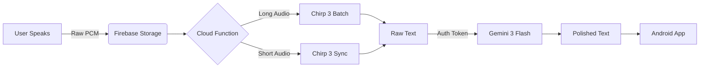
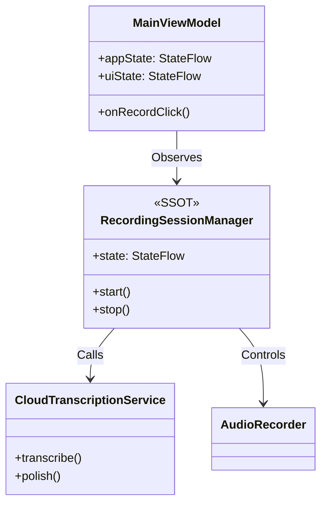

<div align="center">

# 🎙️ VoDrop
### Voice to Text, Instantly.

[](https://kotlinlang.org/docs/multiplatform.html)
[](https://deepmind.google/technologies/gemini/)
[](https://cloud.google.com/speech-to-text)

**Turn rambling voice notes into perfect documents.**
Powered by Google's **Chirp 3** for world-class recognition and **Gemini 3 Flash** for intelligent polishing.

[🎥 **Watch the Demo Video**](LINK_TO_YOUTUBE_VIDEO_HERE)

</div>

---

## 🎯 The Problem
Voice typing is often inaccurate, and raw transcriptions are full of "um", "uh", and rambling sentences. Existing tools are either expensive subscriptions or lack the intelligence to truly "clean up" your speech.

## 💡 The Solution: VoDrop
VoDrop is an open-source, beautifully designed Android app that combines:
1.  **Speed**: One-tap recording with background support.
2.  **Accuracy**: Using Google's massive **Chirp 3** model (2B parameters) via Cloud Functions.
3.  **Intelligence**: **Gemini 3 Flash** refines your text—removing filler words and fixing grammar without changing your meaning.

---

## ✨ Features

| Feature | Tech Stack |
| :--- | :--- |
| **Microphone Management** | Android Foreground Service for bulletproof background recording. |
| **Smart Transcription** | **Chirp 3 (USM)** automatically handles accents and noise. |
| **AI Polish** | **Gemini 3 Flash** rewrites unstructured thought streams into crisp paragraphs. |
| **Unified Architecture** | Single Source of Truth (SSOT) architecture for robust state management. |
| **Material 3 Design** | sleek, modern UI with dark mode support. |

---

## 🧠 AI & Cloud Architecture

VoDrop leverages a serverless architecture to keep client-side minimal and secure.

### 1. The Pipeline


### 2. Why Gemini 3 Flash?
We chose **Gemini 3 Flash** for the "AI Polish" feature because:
*   **Speed**: It returns rewritten text in milliseconds, feeling instant to the user.
*   **Cost**: extremely efficient for high-volume text processing.
*   **Accuracy**: Perfect for understanding context and removing disfluencies ("um", "uh") while preserving the core message.

---

## 🏗️ App Architecture

VoDrop is built with **Kotlin Multiplatform** and follows strict **MVVM + SSOT** principles.



*   **Single Source of Truth**: `RecordingSessionManager` holds the *only* valid state of the recording session.
*   **Thin UI**: The ViewModel simply exposes this state and forwards user intents.

---

## 🚀 Getting Started

### Prerequisites
*   Android Studio Ladybug+
*   Firebase Project (Blaze Plan required for Cloud Functions)
*   Google Cloud Project with **Speech-to-Text API** enabled

### Installation

1.  **Clone the repo**
    ```bash
    git clone https://github.com/yourusername/vodrop.git
    ```

2.  **Setup Firebase**
    *   Add `google-services.json` to `composeApp/`.
    *   Deploy functions:
        ```bash
        cd functions
        npm install
        firebase deploy --only functions
        ```

3.  **Run the App**
    ```bash
    ./gradlew :composeApp:installDebug
    ```

---

## 🔮 Roadmap

*   [x] **Hackathon MVP**: Recording, Chirp 3, Gemini 3 Polish.
*   [ ] **Style Selection**: Choose between "Formal", "Casual", or "Bullet Points" (Powered by dynamic Gemini prompts).
*   [ ] **Desktop Support**: Fully enable the desktop target (currently logic-only).
*   [ ] **WearOS Companion**: Record directly from your watch.

---

<div align="center">
Built with ❤️ for the Gemini 3 Hackathon
</div>
