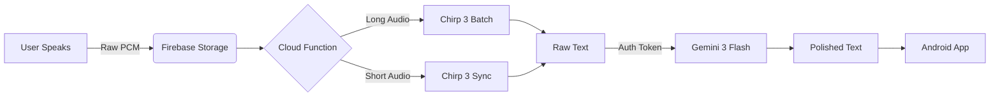
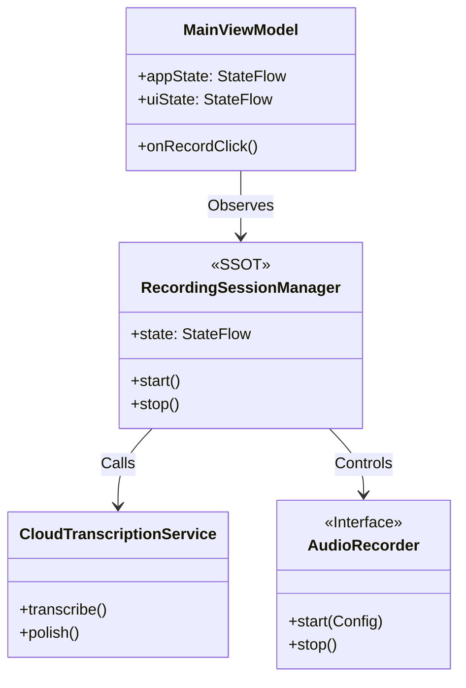

<div align="center">

# 🎙️ VoDrop
### Messaging. Journaling. Prompting. Just drop your voice.

[](https://kotlinlang.org/docs/multiplatform.html)
[](https://deepmind.google/technologies/gemini/)
[](https://cloud.google.com/speech-to-text)
 
> Just tap, speak, and get perfect text.

[🎥 **Watch the Demo Video**](https://youtube.com/shorts/ytGpDQcDo6c)

</div>

---

## 📱 Screenshots

<div align="center">


</div>

---

## 🎯 The Purpose

Life happens on the go. You have a brilliant idea or a complex thought, but:
* **Typing is slow** when you're busy or moving  
* **Voice notes are inconvenient** for the person receiving them  
* **Basic transcription** gives messy text full of filler words

You already know what you want to say.  
You just need it **clean, structured, and ready to use**.

## 💡 The Solution: VoDrop

VoDrop is built for speed and clarity.

Speak naturally.  
VoDrop formats your speech into clean, readable text — instantly.

### Core Use Cases

#### 1. 💬 Messaging
Don't spend minutes typing out a long explanation. Speak it naturally. VoDrop instantly turns your rambling into a clean, readable message ready for WhatsApp, Slack, or Email.

#### 2. 🤖 Prompt Engineering
LLMs (like Gemini) need clear instructions. If you ramble, they hallucinate.
**With VoDrop:** Speak your complex request → VoDrop structures it → Paste into Gemini -> Get perfect results.

#### 3. 📔 Journaling
Capture your day without the friction of typing. Turn a 2-minute stream of consciousness into a beautifully formatted journal entry.

---

## ❤️ Philosophy: Keep It Real
**"Keep your voice original."**

Most AI tools rewrite your text until you sound like a robot.  
VoDrop does the opposite.

VoDrop focuses on improving clarity, not changing personality.

It can:
* Fix grammar and sentence flow  
* Remove filler words like "um", "uh", or repeated starts  
* Break long thoughts into readable sentences  
* Correct obvious transcription mistakes using context  
* Organize text into clean paragraphs or lists when needed  

But it **does not rewrite your message into something different**.

The goal is simple:  
When someone reads your message, it should still sound like you said it —  
just clearer, cleaner, and easier to read.

VoDrop improves how your message is written.  
It does not change what you meant to say.

---

## ✨ Features

| Feature                   | Tech Stack                                                                      |
|:--------------------------|:--------------------------------------------------------------------------------|
| **Microphone Management** | Android Foreground Service for bulletproof background recording.                |
| **Smart Transcription**   | **Chirp 3 (USM)** automatically handles accents and noise.                      |
| **AI Polish**             | **Gemini 3 Flash** rewrites unstructured thought streams into crisp paragraphs. |
| **Unified Architecture**  | Single Source of Truth (SSOT) architecture for robust state management.         |
| **Material 3 Design**     | sleek, modern UI with dark mode support.                                        |

---

## 🧠 AI & Cloud Architecture

VoDrop leverages a serverless architecture to keep client-side minimal and secure.

### 1. The Pipeline


### 2. Why Gemini 3 Flash?
We chose **Gemini 3 Flash** for the "AI Polish" feature because:
*   **Speed**: It returns rewritten text in very fast, feeling instant to the user.
*   **Cost Efficiency**: It is extremely efficient for high-volume text processing, making the business model viable.
*   **Intelligent Instruction Following**: It perfectly understands the nuance of "fixing grammar without changing the tone," a task where smaller models often fail.

---

## 🏗️ App Architecture

VoDrop is built with **Kotlin Multiplatform (KMP)** and follows strict **MVVM + SSOT** principles.



*   **Single Source of Truth**: `RecordingSessionManager` holds the *only* valid state of the recording session.
*   **Platform Specifics**: The `AudioRecorder` uses native implementations (Android `AudioRecord`, Java `TargetDataLine` for Desktop) to ensure low-latency raw byte capture across platforms.
*   **Thin UI**: The ViewModel simply exposes this state and forwards user intents, keeping the logic decoupled from the UI/Platform.

---

## 🚀 Getting Started

### Prerequisites
*   Android Studio Ladybug+
*   Firebase Project (Blaze Plan required for Cloud Functions)
*   Google Cloud Project with **Speech-to-Text API** enabled

### Installation

1.  **Clone the repo**
    ```bash
    git clone https://github.com/CodePandaaAI/VoDrop.git
    ```

2.  **Setup Firebase**
    *   Add `google-services.json` to `composeApp/`.
    *   Deploy functions:
        ```bash
        cd functions
        npm install
        firebase deploy --only functions
        ```

3.  **Run the App**
    ```bash
    ./gradlew :composeApp:installDebug
    ```

---

## 🔮 Roadmap

*   [x] **Hackathon MVP**: Recording, Chirp 3, Gemini 3 Flash Polish.
*   [ ] **Style Selection**: Choose between "Formal", "Casual", or "Bullet Points" (Powered by dynamic Gemini prompts).
*   [ ] **Desktop Support**: Fully enable the desktop target (currently logic-only).
*   [ ] **iOS Support**: Expand the KMP codebase to target iOS users.

---

<div align="center">
Built with ❤️ for the <a href="https://gemini3.devpost.com/">Google Gemini 3 Hackathon</a> on Devpost
</div>
